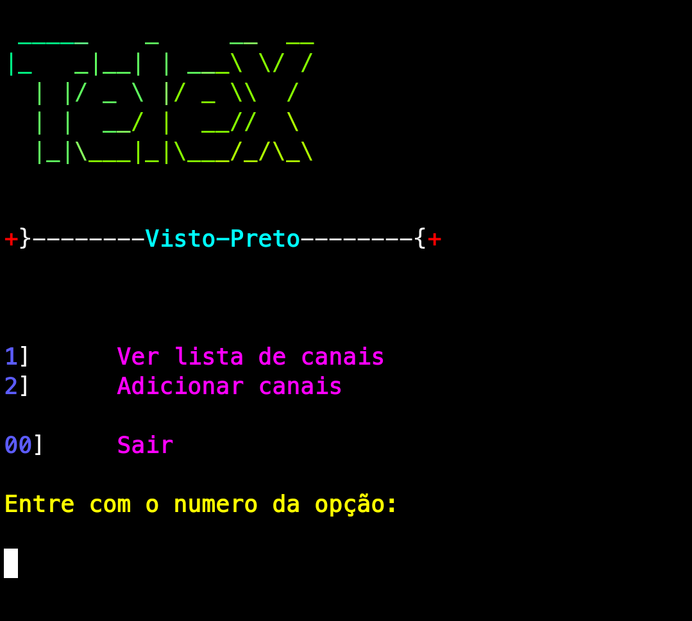
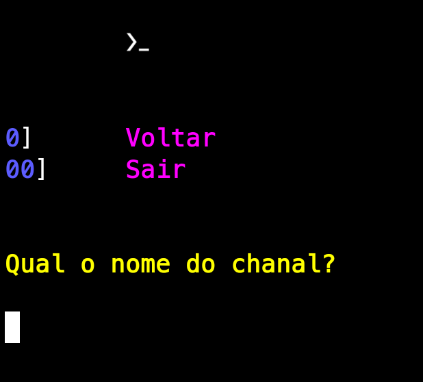
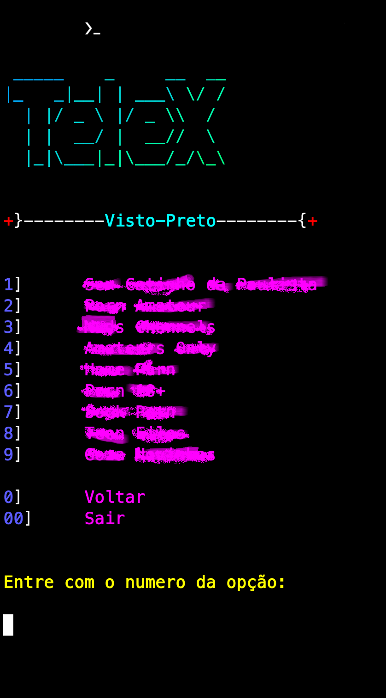
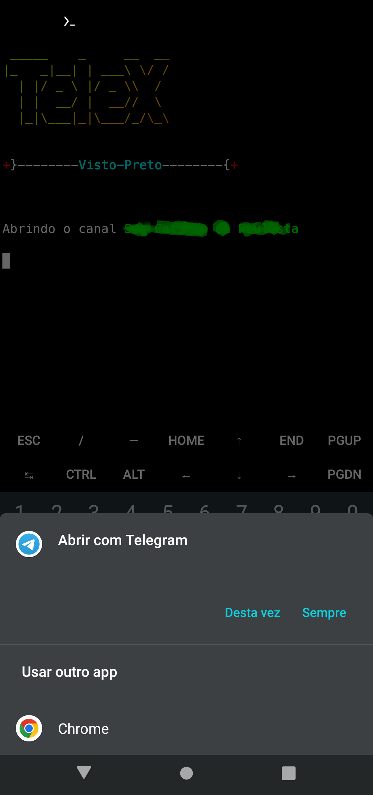

  
 
O TeleX é um script desenvolvido para ter acesso a canais do telegram sem a 
necessidade de entrar no mesmo. 
Voçê pode salva uma lista de canais para acessa-los e visualizar ou salvar 
qualquer mídias, quando o usuário seleciona um canal da lista o TeleX altera
o volume de mídia para 0% e ao sair, ele altera o volume de mídia para 60%.
O usuário pode alterar o volume a qualquer hora quando acessando os canais, 
sendo que o TeleX alterará o volume para 0% toda vez que abrir um canal. assim 
o mesmo evita que algum audio das mídias visualizadas seja reproduzido em momentos 
que não queremos que alguem ouça o que estamos vendo.

   
 
O usuário pode adicionar quantos canais querer na lista.

   

## Requisitos
 **Termux**  https://f-droid.org/pt_BR/packages/com.termux
**Termux:API** https://f-droid.org/pt_BR/packages/com.termux.api/

## Instalação
curl -sLf https://raw.githubusercontent.com/Visto-Preto/TeleX/master/install.sh | bash

## Uso
Digite o comando **telex** no terminal
